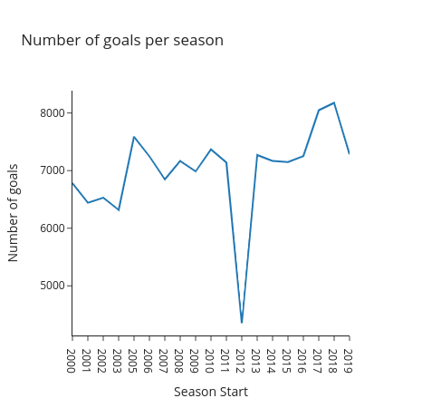
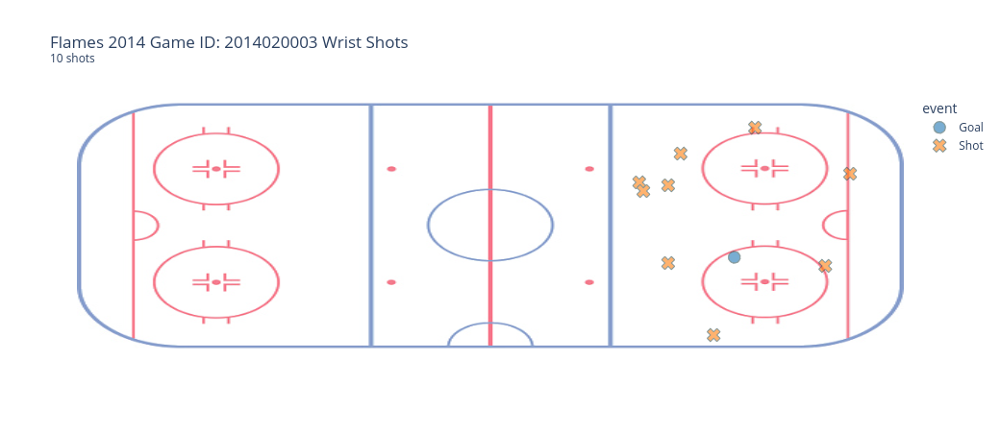

<H1 align="center"> 🏒 Project: NHL 🏒 </H1>

Data for this project can be found in [this](https://www.kaggle.com/datasets/martinellis/nhl-game-data) kaggle link. According to the author:

> The data represents all the official metrics measured for each game in the NHL (from 200 to 2019). I intend to update it semi-regularly depending on development progress of my database server.

We loaded the data into a SQLite database using the simple [DB Browser for SQLite](https://sqlitebrowser.org/).

## Data exploration with SQL and Plotly

Using our SQLite database we will answer exploratory questions using SQL queries. To this end, we'll use python's `sqlite3` module to run queries and `pandas` to get our results in dataframe objects.

The dataset used consists of 13 tables containing information about teams, players, game stats and more. A detailed relationship scheme between tables can be found in the schema below.

<figure>

<figcaption align = "center"><b>Fig.1 - Tables and relationships between them.</b></figcaption>
</figure>

For our visualizations we'll use Plotly for its awesome interactive functions!

## Basic stats and Exploration - SQL

A first exploration of the data is done using SQL through the SQLite3 module in python. The notebook with SQL queries answering basic questions can be found [here](EDA-SQL.ipynb). Besides exploring the data, in this notebook we create a series of filtered dataframes to be used further along in the project.

## EDA (with visuals!)

After exploring the data, cleaning and filtering some useful dataframes, we use *pandas* and *plotly* to create some visuals on the data. The notebook with all of this can be found [here](EDA.ipynb). In this, we also prepare some functions to be used in our **Dash app** for interactive online data exploration.

### Some of our graphs:

Number of goals scored in each season:
<figure>

<figcaption align = "center"><b>Fig.2 - Goals scored per season in the NHL</b></figcaption>
</figure>

For a specific team, we can get line plots for evolution of goals scored and goals conceded throughout the seasons. For example, here we have the evolution for the Calgary Flames:

<figure>

<figcaption align = "center"><b>Fig.3 - Evolution of Goals for the Calgary Flames</b></figcaption>
</figure>

Given a specific year (start of season), we can plot a heatmap of the positions of golas scored by a team. In the figure bellow we see the goal placement for the  Calgary Flames in 2014:

<figure>

<figcaption align = "center"><b>Fig.4 - Goal placement for the Calgary Flames in the 2014 season.</b></figcaption>
</figure>

Finally, given a specific game and shot type, we can plot the shot placement colored by wether it was a goal or not. In the figure bellow, we can see the **Wrist Shot** placement for the Flames ina 2014 game:

<figure>

<figcaption align = "center"><b>Fig.4 - Goal placement for the Calgary Flames in the 2014 season.</b></figcaption>
</figure>

## Dashboarding with *Dash App*

Inside [this folder](nhl-dash), we have the script (and all required assets) to build our interactive dashboard using [Dash](https://dash.plotly.com/).

An example usage of the app can be seen in the gif bellow.

*Example usage of dash app.*

## Modeling

We try to create a model to predict Goal probability given features on position and time. As expected, the model doesn't have a great accuracy (there are LOTS more features influencing goal probability), but the exrcise was fun!

Without any tuning, this is our achieved accuracy on different models:

|    | model                           |   mean_accuracy |
|---:|:--------------------------------|----------------:|
|  0 | BalancedBaggingClassifier       |        0.401658 |
|  1 | RandomForestClassWeight         |        0.593666 |
|  2 | RandomForestBoostrapClassWeight |        0.593498 |

Description of steps to clean the data and build the models for prediction can be found [here](Modeling.ipynb). The actual script for training the models can be found [here](modeling.py).

## Finding files

* Data exploration:
    * [SQL](EDA-SQL.ipynb)
    * [Visuals (Python)](EDA.ipynb)
* Modeling:
    * [Descriptive steps](Modeling.ipynb)
    * [Python script](modeling.py)
    * [Hyperparameter tuning](modeling-confusionmatrix.py)
    * [Model evaluation](EvaluatingModel.ipynb)
* Dashboard:
    * [Main folder](/nhl-dash)
    * [Main script](nhl-dash/nhl-dash-app-modular.py)
    * [Functions for dashboard](nhl-dash/functions.py)
    * [Constants for dashboard](nhl-dash/CONSTANTS.py)
